# SC2001 Project 2 — Dijkstra's Algorithm: Graph Representation × Priority Queue

**Deliverables in this folder**

| File | Contents |
|---|---|
| `dijkstra.c` | C implementation of (a) and (b), the graph generators and the experiment driver (every number below comes from this) |
| `plots.py` | Generates every figure from the raw CSVs |
| `exp_vsV.csv` | Vary $\lvert V\rvert$ at three fixed densities (sparse, half-full, complete) |
| `exp_vsE.csv` | Vary $\lvert E\rvert$ from a tree to a complete graph at $\lvert V\rvert$ = 1,000, 3,000, 10,000 |
| `exp_sparse.csv` | Large sparse graphs, $\lvert E\rvert=8\lvert V\rvert$, $\lvert V\rvert$ up to $2^{22}\approx4.2$ million |
| `exp_adv.csv` | Adversarial graph built to force (b)'s worst case, plus a random-weight control on the same edges |
| `exp_sources.csv` | (a) and (b) run from 20 different source vertices of the same graphs, to check that the choice of source does not matter |
| `verify.txt` | Output of the correctness suite |
| `fig1 … fig11 .png` | Figures for (a), (b) and (c) (11 files, one graph each) |
| `small_directed_weighted_graph.png` | The small example graph used in the theory sections |
| `extra_*.csv`, `extra1 … extra3 .png` | Data and figures for the **Extra information** section only (see the note below) |

Machine: Intel Core Ultra 7 265KF (20 cores, 30 MB L3), 31 GB RAM, Ubuntu 26.04 under WSL2,
`gcc 15.2.0 -O2`. CPU time measured with `clock_gettime(CLOCK_PROCESS_CPUTIME_ID)` (nanosecond
resolution).

**Reproducing everything**

```
gcc -O2 -o dijkstra dijkstra.c -lm
./dijkstra verify                 # correctness checks
./dijkstra vsV    > exp_vsV.csv     # (a),(b): vary |V| at fixed density        (~0.5 min)
./dijkstra vsE    > exp_vsE.csv     # (a),(b): vary |E| at fixed |V|            (~0.5 min)
./dijkstra sparse > exp_sparse.csv  # (b),(c): sparse graphs up to 4.2 M vertices (~1 min)
./dijkstra adv    > exp_adv.csv     # (c): worst case for the heap              (~10 s)
./dijkstra sources > exp_sources.csv # does the source vertex matter?           (~1 min)

./dijkstra vsV extra    > extra_vsV.csv     # Extra information only: same graphs,
./dijkstra vsE extra    > extra_vsE.csv     #   extra variants
./dijkstra sparse extra > extra_sparse.csv

python3 plots.py                  # writes all figures
```

Every graph is generated from a fixed seed, so the graphs and all operation counts reproduce exactly.
Peak memory is ~2.4 GB (the $\lvert V\rvert=10^4$ complete graph held as a matrix and as lists at
once).

> **About the Extra information section.** The project asks for exactly two implementations, and
> every formal section, figure (fig1–fig11) and conclusion below uses only those two. Some
> measurements of (a) and (b) can't be explained by those two alone. For those, the last section
> of the report adds three extra variants, each kept to the one question it answers. Each formal
> section points to the extra item that explains it.

---

## Notation used throughout

**What Dijkstra's algorithm computes.** Given a weighted graph and one chosen starting vertex,
the **source** $s$, it finds the length of the shortest path from $s$ to *every* vertex. That is
the single-source shortest-paths problem. The source can be any vertex. Running from a different
source gives a different set of answers, but the same algorithm and the same cost analysis.

| Symbol | Meaning |
|---|---|
| $\lvert V\rvert$, $\lvert E\rvert$ | number of vertices / directed edges. Vertices are numbered $0,1,\dots,\lvert V\rvert-1$ |
| $w(u,v)$ | weight (length) of the edge $u\to v$ |
| $s$ | the source vertex. Every experiment uses $s=0$; *Input graphs* explains why, and checks that it makes no difference |
| $d[v]$ | the length of the shortest path **from $s$ to $v$** found so far. It starts at $\infty$ (no path known yet) for every $v\ne s$, and at $0$ for $s$ itself. It only ever decreases, and when $v$ is extracted it equals the true shortest distance from $s$ to $v$ |
| $d[0\ldots\lvert V\rvert-1]$ | the array holding $d[v]$ for every vertex $v$. Entry $v$ is vertex $v$'s current distance from $s$. When the algorithm finishes, this array is the answer |
| density | $\lvert E\rvert/(\lvert V\rvert(\lvert V\rvert-1))$ — the fraction of all possible edges present (1 = complete graph) |
| $k$ | average out-degree $\lvert E\rvert/\lvert V\rvert$ |
| **relaxation** | for an edge $u\to v$: check whether going to $u$ and then along the edge is shorter than the best path to $v$ known so far, i.e. whether $d[u]+w(u,v)<d[v]$ |
| **successful relaxation** | one where the check succeeds and $d[v]$ is lowered to $d[u]+w(u,v)$. With a heap this is a **decrease-key** |
| **extract-min** | remove, from the priority queue, the not-yet-finished vertex with the smallest $d$. Its distance from $s$ is then final |

---

## The two implementations

| | Graph stored as | Priority queue | Worst-case time |
|---|---|---|---|
| **(a)** `mat_arr` | adjacency matrix | unsorted array indexed by vertex (the distance array itself), scanned for the minimum | $\Theta(\lvert V\rvert^2)$ |
| **(b)** `list_heap` | array of adjacency lists | indexed binary min-heap with decrease-key | $O((\lvert V\rvert+\lvert E\rvert)\log\lvert V\rvert)$ |

```
(a)  for each v: d[v] = ∞, finished[v] = false;   d[s] = 0
     repeat |V| times:
         u = the unfinished v with the smallest d[v]           # scan all |V| slots
         finished[u] = true
         for v = 0 … |V|-1:                                    # scan the whole matrix row
             if M[u][v] ≠ 0 and d[u] + M[u][v] < d[v]:
                 d[v] = d[u] + M[u][v]                         # lowering the key: O(1)

(b)  for each v: d[v] = ∞;   d[s] = 0;   put every vertex in the heap (s at the root)
     while heap not empty:
         u = extract-min()                                     # O(log |V|)
         for each (v, w) in adj[u]:                            # only u's real out-edges
             if d[u] + w < d[v]:
                 d[v] = d[u] + w;   decrease-key(v)            # sift v up, O(log |V|)
```

Neither implementation checks whether $v$ is already finished before relaxing an edge into it,
and neither needs to. A finished vertex's distance is final, and vertices finish in increasing
order of distance, so $d[v]\le d[u]<d[u]+w$ and the test $d[u]+w<d[v]$ fails on its own. Leaving
the redundant check out removes the same unnecessary work from both implementations. (The
`finished` flag in (a) is still needed, but only by extract-min, to skip vertices that have
already been taken.)

The heap is **indexed**: a `pos[v]` array records where each vertex sits in the heap, so
decrease-key can find $v$ in $O(1)$ and sift it up. The array in (a) needs no such index, because
slot $v$ simply *is* vertex $v$. Both implementations follow the priority-queue formulation of
Dijkstra's algorithm in Cormen et al., *Introduction to Algorithms* (3rd ed., §24.3). That section
analyses exactly these two queues: an array indexed by vertex, giving $O(\lvert V\rvert^2)$, and a
binary min-heap with DECREASE-KEY, giving $O((\lvert V\rvert+\lvert E\rvert)\log\lvert V\rvert)$.
The adjacency lists are stored as one contiguous array of `(v, w)` pairs, with `off[u]` marking
where $u$'s list starts (CSR layout). This is an array of adjacency lists packed end to end. It is
not a linked list, which would add a pointer dereference per edge.

**What is counted.** Each implementation counts three hardware-independent quantities alongside
the CPU time:

* `pq_ops` — work inside the priority queue. For the array, the number of slots scanned by
  extract-min. For the heap, the number of key comparisons made while sifting.
* `edge_ops` — adjacency entries examined during relaxation: matrix cells for (a), list entries for
  (b).
* `updates` — successful relaxations (= decrease-key calls in (b)).

**Correctness.** `./dijkstra verify` runs both implementations (and the extra variants) on 1,281
graphs: every $\lvert V\rvert=1\ldots80$ at five densities from tree to complete, three seeds each,
plus every adversarial graph up to $\lvert V\rvert=80$ and one 60,000-vertex sparse graph. It checks
every distance against an independent Bellman-Ford. It also checks the generator (exact edge count,
no self-loops, no duplicate edges) and the exact count identities derived below:
`pq_ops` = `edge_ops` = $\lvert V\rvert^2$ for (a), `edge_ops` = $\lvert E\rvert$ for (b), and
`updates` = $\lvert E\rvert$ on the adversarial graph. **All pass.** In addition, every
measurement re-checks that (a) and (b) produce identical distances on that graph.

## Input graphs

The project does not say which graphs to test on, so the choices below were made deliberately.
Each one is either required for Dijkstra's algorithm to work at all, or keeps the comparison
between (a) and (b) fair.

### What the graphs must satisfy, and why

* **No negative edge weights.** Dijkstra relies on one fact. When a vertex is extracted, its
  $d$ is final: every unfinished vertex is at least as far from $s$, and following more edges of
  non-negative weight can only make a path longer. A negative edge breaks this. Take
  $s\to a$ (weight 2), $s\to b$ (3), $b\to a$ ($-2$). Dijkstra extracts $a$ first with $d[a]=2$
  and never revisits it, but the path $s\to b\to a$ has length 1. The algorithm returns **wrong
  answers**, not merely slow ones. With a negative-weight cycle, "shortest path" is not even
  defined, since going round the cycle again always makes the path shorter. Graphs with negative
  weights need a different algorithm (Bellman–Ford), so they are outside this project.
* **Weights are positive integers, from 1 to $10^6$.** Zero-weight edges would be fine for
  Dijkstra. They are excluded only because (a)'s matrix uses 0 to mean "no edge". Integer weights
  keep every comparison exact, so (a), (b) and Bellman–Ford can be checked against each other for
  exact equality. The longest possible path ($\approx10^6\times\lvert V\rvert$) still fits easily in
  a 64-bit integer.
* **Directed.** Directed graphs are the general case. An undirected edge $\{u,v\}$ is just the
  pair $u\to v$ and $v\to u$, so an undirected graph is a directed graph with every edge stored in
  both directions (which also makes its adjacency matrix symmetric; see §(a)). The algorithms and
  their complexity are unchanged; only $\lvert E\rvert$ doubles. Directed graphs also let the
  density run all the way to a complete graph with $\lvert V\rvert(\lvert V\rvert-1)$ edges.
* **No self-loops and no parallel edges.** A self-loop $u\to u$ can never shorten a path. The
  matrix has only one cell per ordered pair $(u,v)$, so (a) cannot store two different edges
  $u\to v$. Excluding both guarantees that (a) and (b) see exactly the same graph.
* **Every vertex is reachable from the source.** Dijkstra never finalises a vertex it cannot
  reach. (a) stops once every unfinished vertex is still at $\infty$, and (b) once only $\infty$
  keys remain in its heap. The work done would then depend on how much of the graph happened to be
  reachable, not only on $\lvert V\rvert$ and $\lvert E\rvert$, which would blur every growth-rate
  measurement. Guaranteeing reachability makes every run do exactly $\lvert V\rvert$ extractions.
* **Cycles are allowed.** With non-negative weights Dijkstra handles cycles without trouble, and
  the random graphs contain plenty of them. Only the adversarial graph is acyclic, because its
  construction needs a fixed extraction order.

### The source vertex

Dijkstra's algorithm can start from any vertex; nothing in a graph designates a "root". The
experiments always use vertex 0 for one practical reason. The generator builds its spanning tree
outward from vertex 0, which guarantees that vertex 0 reaches every other vertex. Apart from that,
vertex 0 is not special: all other vertex labels are randomly shuffled, and the remaining edges
are uniform over all pairs. (Strictly, as the tree's root, vertex 0 tends to have a few more
out-edges than average.)

To check that this choice does not affect the results, `./dijkstra sources`
(`exp_sources.csv`) runs (a) and (b) on the same three graphs ($\lvert V\rvert=10{,}000$, average
degree 8, 100 and 1,000). Each graph is run from vertex 0 and from 19 randomly chosen vertices:

| average degree | 8 | 100 | 1,000 |
|---|---:|---:|---:|
| vertices reached, all 20 sources | 10,000 | 10,000 | 10,000 |
| (a) operations, every source | exactly $2\lvert V\rvert^2$ | exactly $2\lvert V\rvert^2$ | exactly $2\lvert V\rvert^2$ |
| (b) decrease-keys per vertex: source 0 / range over the other 19 | 1.810 / 1.796–1.817 | 4.203 / 4.159–4.226 | 6.466 / 6.460–6.516 |
| (b) time (ms): source 0 / range over the other 19 | 0.96 / 0.95–0.98 | 1.93 / 1.90–1.96 | 11.32 / 10.81–12.73 |

Every source reaches the whole graph, (a) does identical work from all of them, and (b)'s
measurements from vertex 0 sit inside the range of the other 19. So the results from vertex 0
stand for any source. The one exception is the sparsest end of the sweeps, a bare tree with
$\lvert E\rvert=\lvert V\rvert-1$. Its edges all point away from vertex 0, so any other source
reaches only its own subtree. That is exactly why the experiments use the tree's root.

### Random graphs

Each graph first gets a random spanning tree rooted at vertex 0 (the source), so every vertex is
reachable and all $\lvert V\rvert$ vertices get extracted. The remaining
$\lvert E\rvert-(\lvert V\rvert-1)$ edges are drawn uniformly from all other ordered pairs, without
duplicates. Weights are uniform integers in $[1,10^6]$. Densities run from a bare tree
($\lvert E\rvert=\lvert V\rvert-1$) to a complete graph, on a logarithmic grid of 13 points per
$\lvert V\rvert$.

### Adversarial graph

A complete DAG (edge $i\to j$ for every $i<j$) whose weights are chosen so
that **every edge is a successful relaxation and every decrease-key sifts its vertex to the top of
the heap**. That is exactly the worst case the $O(\lvert E\rvert\log\lvert V\rvert)$ bound
describes; the construction is in §(b). The same edge set with random weights is run alongside it
as a control.

> **Method note.** Generation, matrix/list construction and memory allocation are outside the timed
> region. Initialising $d[\,]$ and the priority queue is inside it, because it is part of the
> algorithm. Each point is timed with enough back-to-back repetitions to fill ≥ 30 ms, repeated 5
> times (3 if a single run exceeds 1 s), and the **median** is reported. One graph is generated per
> $(\lvert V\rvert,\lvert E\rvert)$ point. The `updates` count can differ by a handful between (a)
> and (b) on the same graph. This happens when two vertices tie on distance and the two
> implementations extract them in different orders. The distances themselves are always identical.
>
> The matrix is allocated with `malloc` + `memset`, not `calloc`. In a first run, `calloc`'d
> pages that were never written stayed mapped to the kernel's shared zero page, and reading those
> was several times slower per cell than reading ordinary memory. Since a very sparse graph writes
> to almost no matrix pages, the *sparsest* graphs came out up to 3× slower than moderately sparse
> ones. Touching every page gives a matrix that behaves like one that has actually been filled in,
> and every number in this report is from the corrected code.

---

## (a) Adjacency matrix + array priority queue

### Theory

**The data structures.** The examples here and in §(b) use one small directed graph:
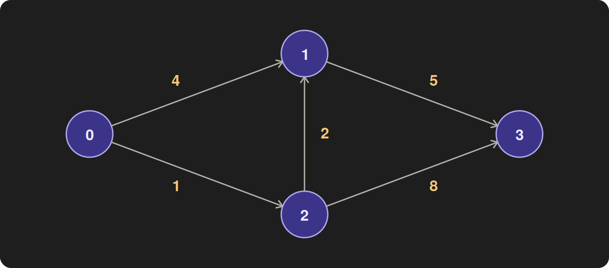

*Adjacency matrix.* A $\lvert V\rvert\times\lvert V\rvert$ table where cell $M[u][v]$ holds the weight
of edge $u\to v$, or 0 if there is no such edge (all weights are $\ge1$, so 0 is never a real
weight). Row $u$ describes every possible edge out of $u$, present or not, and column $v$ every
possible edge into $v$:

```
            to:  0  1  2  3
   from 0:     [ 0  4  1  0 ]
        1:     [ 0  0  0  5 ]
        2:     [ 0  2  0  8 ]
        3:     [ 0  0  0  0 ]
```

This matrix is **not symmetric**, because the graph is directed. $M[0][1]=4$ is the edge
$0\to1$, while $M[1][0]$ would be a different edge, $1\to0$, which does not exist. An adjacency
matrix is symmetric only for an **undirected** graph. There, each edge $\{u,v\}$ can be travelled
both ways, so it is recorded as both $M[u][v]$ and $M[v][u]$ with the same weight. Symmetry is
a property of undirected graphs, not of adjacency matrices in general. This project uses directed
graphs (see *Input graphs*), so its matrices are generally not symmetric.

Checking whether $u\to v$ exists is a single lookup, $O(1)$. But there is no way to list just the
edges out of $u$: finding them means reading all $\lvert V\rvert$ cells of row $u$, most of which
are 0 in a sparse graph. The table always takes $\lvert V\rvert^2$ cells, however few edges there
are.

*Array as the priority queue.* Dijkstra's priority queue has to hand back the unfinished vertex
closest to the source, i.e. the one with the smallest $d[v]$. Here the queue is simply the
distance array $d[0\ldots\lvert V\rvert-1]$ itself, **indexed by vertex**: slot $v$ holds vertex
$v$'s key, $d[v]$. A separate `finished` flag per vertex marks the ones already extracted.

* **extract-min** scans all $\lvert V\rvert$ slots and returns the unfinished vertex with the
  smallest $d$, which costs $O(\lvert V\rvert)$. Finished vertices stay in the array and are
  skipped by the flag test.
* **lowering a key** (when a relaxation succeeds) just overwrites $d[v]$, which costs $O(1)$.

On the example, with source $s=0$: after vertex 0 is processed (its edges give $d[1]=4$ and
$d[2]=1$), the array holds $d=[0^{\checkmark},\,4,\,1,\,\infty]$. The $\checkmark$ marks vertex 0
as finished, and $\infty$ means no path to vertex 3 is known yet. The scan picks vertex 2, the
closest unfinished vertex.

*Why an unsorted array.* An array can be used as a priority queue in more than one way. The
unsorted, vertex-indexed form is the one Cormen et al. analyse, and it keeps the array's one real
strength.

* **What an array does well: updates.** A key is lowered by overwriting one slot, in $O(1)$, with
  no reordering. Dijkstra lowers a key once per successful relaxation, which can be up to
  $\lvert E\rvert$ times.
* **What an array does badly: extract-min.** Finding the minimum of unsorted data means looking at
  every slot, $O(\lvert V\rvert)$ each time.
* **Why not keep the array sorted?** A sorted array would make extract-min $O(1)$, because the
  minimum is always at the front. But every successful relaxation would then have to move the
  vertex to its new position, shifting up to $\lvert V\rvert$ entries. That gives up the array's
  cheap updates and makes the worst case $O(\lvert V\rvert\cdot\lvert E\rvert)$, i.e.
  $O(\lvert V\rvert^3)$ on a dense graph. It cannot help (a) asymptotically either, because the
  matrix row scans already cost $\lvert V\rvert^2$ on their own. Keeping the array *partially*
  ordered so the minimum can be found quickly would amount to rebuilding a heap, which is (b)'s
  job.
* **A constant-factor variant not used here.** Removing finished vertices from the array, instead
  of flagging them, would shrink each scan to the vertices still unfinished. That is
  $\lvert V\rvert(\lvert V\rvert+1)/2$ slots in total instead of $\lvert V\rvert^2$, the same
  $\Theta(\lvert V\rvert^2)$. The vertex-indexed form is used because it is the standard one, and
  because the distance array then doubles as the queue with no extra bookkeeping.

So the array keeps updates free and extract-min linear. With a matrix, every relaxation step is
also a full row scan. Together, those give the cost below.

**Cost.** The outer loop runs $\lvert V\rvert$ times (each vertex is extracted once). Each iteration
does two full scans:

* **extract-min** scans all $\lvert V\rvert$ array slots: $\lvert V\rvert$ per iteration,
  $\lvert V\rvert^2$ in total;
* **relaxation** scans the whole matrix row of $u$, because a matrix cannot list only $u$'s
  neighbours. It has to look at every cell to find out which ones are edges: again
  $\lvert V\rvert$ per iteration, $\lvert V\rvert^2$ in total.

So the work is **exactly $2\lvert V\rvert^2$ slot inspections, for every graph**: best, average and
worst case coincide.

$$T_a(\lvert V\rvert,\lvert E\rvert)=\Theta(\lvert V\rvert^2)\qquad\text{independent of }\lvert E\rvert.$$

$\lvert E\rvert$ only affects how many of the row cells hold an edge and how many relaxations
succeed (at most $\lvert E\rvert$ updates, an $O(\lvert E\rvert)\subseteq O(\lvert V\rvert^2)$
term). Since $\lvert E\rvert\le\lvert V\rvert^2$ always,
$\Theta(\lvert V\rvert^2+\lvert E\rvert)=\Theta(\lvert V\rvert^2)$. Memory is also
$\Theta(\lvert V\rvert^2)$: $4\lvert V\rvert^2$ bytes for the matrix of `int` weights.

The measured counts confirm this exactly. `pq_ops` = `edge_ops` = $\lvert V\rvert^2$ in every one of
the 82 measurements of (a), from a 999-edge tree to a 100-million-edge complete graph.

### Empirical: time vs $\lvert V\rvert$

`exp_vsV.csv`, **fig 1** and **fig 2**.

| $\lvert V\rvert$ | 500 | 1,000 | 2,000 | 4,000 | 6,000 | 8,000 | 10,000 |
|---|---:|---:|---:|---:|---:|---:|---:|
| $\lvert E\rvert=8\lvert V\rvert$ (ms) | 0.21 | 0.81 | 4.00 | 18.0 | 40.0 | 68.0 | 111.0 |
| half-full (ms) | 0.91 | 3.71 | 14.9 | 61.2 | 142.0 | 259.0 | 417.9 |
| complete (ms) | 0.22 | 0.85 | 4.03 | 19.0 | 43.4 | 77.1 | 125.2 |

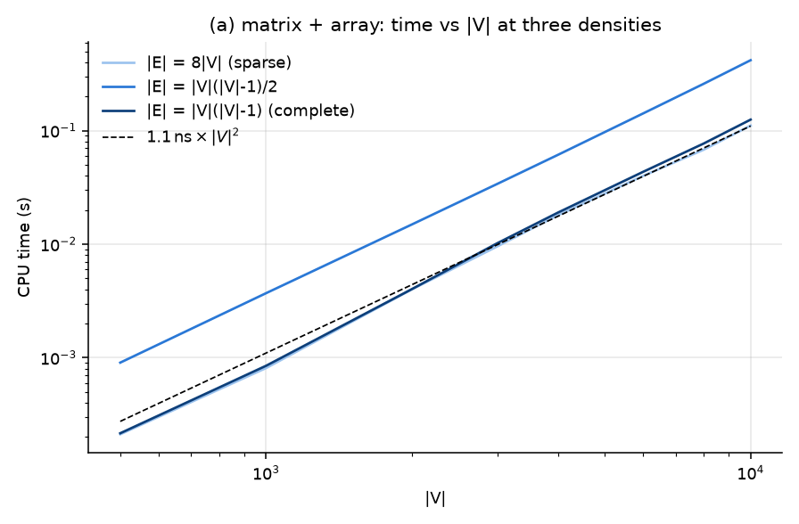

**Fig 1** is log–log, so $\Theta(\lvert V\rvert^2)$ appears as a straight line of slope 2. The fitted
slopes for $\lvert V\rvert\ge2000$ are **2.05** (sparse), **2.07** (half-full) and **2.12**
(complete). The growth law matches theory. What does *not* match is the vertical gap between the
curves: the half-full graph takes **3.3–4.6×** longer than the sparse or complete ones at the same
$\lvert V\rvert$, although all three do exactly $2\lvert V\rvert^2$ inspections.

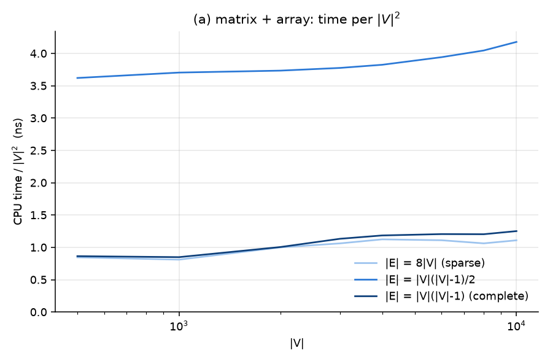

**Fig 2** divides by $\lvert V\rvert^2$. The sparse and complete curves sit at **0.8–1.25 ns** per
$\lvert V\rvert^2$, and the half-full one at **3.6–4.2 ns**. Within each density the cost per
$\lvert V\rvert^2$ is close to constant, which is the $\Theta(\lvert V\rvert^2)$ result. Across
densities it is not.

### Empirical: time vs $\lvert E\rvert$ at fixed $\lvert V\rvert$

`exp_vsE.csv`, **fig 3**. Theory predicts a flat line.

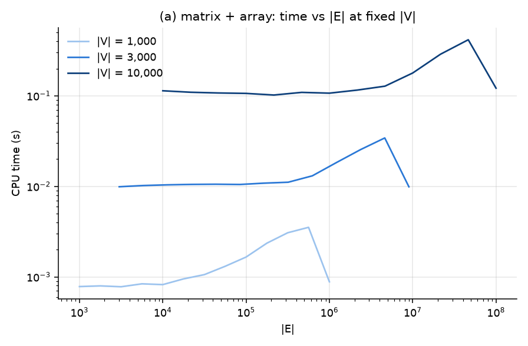

| $\lvert V\rvert$ | fastest density | slowest density | spread |
|---:|---:|---:|---:|
| 1,000 | 0.78 ms | 3.53 ms (56 % density) | **4.5×** |
| 3,000 | 9.9 ms | 34.3 ms (51 %) | **3.5×** |
| 10,000 | 102 ms | 416 ms (46 %) | **4.1×** |

Time is flat up to about 1 % density, as predicted. It then rises to a peak near **50 % density**
and drops back at the complete graph. Over that whole range the operation count does not change:
it is $2\lvert V\rvert^2$ at every point on these curves. So the hump does not come from the
algorithm doing more work. It comes from how fast the CPU executes the same work at different
densities. **Extra information E1** identifies the cause as branch misprediction on the
`M[u][v] ≠ 0` test. With that removed, the curves are flat to within 7–20 %.

### Verdict on (a)

$\Theta(\lvert V\rvert^2)$ time and memory, independent of $\lvert E\rvert$. Confirmed by the exact
counts ($2\lvert V\rvert^2$ in every run) and by measured slopes of 2.05–2.12. The constant is
0.8–1.25 ns per $\lvert V\rvert^2$ on sparse and complete graphs on this machine. It rises to
~4 ns at intermediate densities for a hardware reason, not an algorithmic one (E1).

---

## (b) Adjacency lists + min-heap priority queue

### Theory

**The data structures.** These use the same example graph as §(a).

*Array of adjacency lists.* An array with one entry per vertex. Entry $u$ holds a list of only the
edges that actually leave $u$, each stored as a (target, weight) pair:

```
   0: (1,4) (2,1)
   1: (3,5)
   2: (1,2) (3,8)
   3: —
```

Listing $u$'s out-edges takes time proportional to how many there are, $O(\deg u)$, so a full pass
over every list touches each edge exactly once: $O(\lvert V\rvert+\lvert E\rvert)$. Storage is also
$O(\lvert V\rvert+\lvert E\rvert)$, against the matrix's $\lvert V\rvert^2$. The price is that
checking whether one particular edge $u\to v$ exists means searching $u$'s list. Dijkstra never
needs that operation, so it costs nothing here. (How the lists are laid out in memory is described
under *The two implementations*.)

*Minimizing heap as the priority queue.* A binary min-heap is a complete binary tree with one rule:
**every node's key is $\le$ its children's keys**, so the smallest key is always at the root. It is
stored in a plain array with no pointers: the children of position $i$ sit at positions $2i+1$ and
$2i+2$. Here the keys are the distances from the source, $d[v]$. On the example, with source
$s=0$, just after vertex 0 is processed ($d[1]=4$, $d[2]=1$, $d[3]=\infty$; vertex 0 has left the
heap):

```
           2 (d=1)              array:  [ 2, 1, 3 ]
          /       \                      root first, then level by level
     1 (d=4)    3 (d=∞)
```

* **extract-min** removes the root, moves the last element into its place, and **sifts it down**:
  it swaps with its smaller child until the heap rule holds again. That is at most one swap per
  level, so $O(\log\lvert V\rvert)$.
* **decrease-key** (when a relaxation succeeds) lowers $d[v]$, then **sifts $v$ up**: it swaps with
  its parent while it is smaller than the parent. Again $O(\log\lvert V\rvert)$. To do this, the
  heap must be able to find $v$ in the first place. A companion array `pos[v]` records each
  vertex's current position, which is what makes the heap *indexed*.

So the heap makes extract-min cheap, $O(\log\lvert V\rvert)$ instead of the array's
$O(\lvert V\rvert)$. In exchange, updates go from $O(1)$ to $O(\log\lvert V\rvert)$.

| Operation | (a) matrix + array | (b) lists + heap |
|---|---|---|
| list the out-edges of $u$ | $O(\lvert V\rvert)$ — read the whole row | $O(\deg u)$ |
| extract-min | $O(\lvert V\rvert)$ — scan the array | $O(\log\lvert V\rvert)$ — sift down |
| lower $d[v]$ after a successful relaxation | $O(1)$ — overwrite | $O(\log\lvert V\rvert)$ — sift up |
| memory | $\Theta(\lvert V\rvert^2)$ | $\Theta(\lvert V\rvert+\lvert E\rvert)$ |

Dijkstra performs $\lvert V\rvert$ extract-mins, lists every vertex's out-edges once, and does one
update per successful relaxation. Multiplying those counts by the per-operation costs above gives
each implementation's running time: $\Theta(\lvert V\rvert^2)$ for (a), and for (b) the bound
derived next.

**Cost.**

* **Initialise:** $d[\,]$ and a heap holding all $\lvert V\rvert$ vertices (the source at the root,
  the rest at $\infty$ in any order, already a valid heap): $O(\lvert V\rvert)$.
* **Extract-min**, $\lvert V\rvert$ times: move the last leaf to the root and sift it down,
  $O(\log\lvert V\rvert)$ each, so $O(\lvert V\rvert\log\lvert V\rvert)$.
* **Relaxation:** each vertex's list is scanned once, when it is extracted, so every edge is
  examined **exactly once**: $\Theta(\lvert E\rvert)$ checks in total.
* **Decrease-key:** each *successful* relaxation sifts $v$ up, $O(\log\lvert V\rvert)$. In the worst
  case every edge succeeds, so $O(\lvert E\rvert\log\lvert V\rvert)$.

$$T_b=O\big((\lvert V\rvert+\lvert E\rvert)\log\lvert V\rvert\big),$$

which is $O(\lvert V\rvert\log\lvert V\rvert)$ for sparse graphs ($\lvert E\rvert=O(\lvert V\rvert)$)
and $O(\lvert V\rvert^2\log\lvert V\rvert)$ for dense ones ($\lvert E\rvert=\Theta(\lvert V\rvert^2)$).
Memory is $\Theta(\lvert V\rvert+\lvert E\rvert)$: 8 bytes per edge plus ~25 bytes per vertex
(list offsets, $d$, heap, `pos`).

The bound is a worst case: it treats every edge as a potential decrease-key. Splitting the cost
into its three terms shows where it actually goes:

$$T_b\;=\;\underbrace{\lvert E\rvert}_{\text{edge checks}}\;+\;\underbrace{\lvert V\rvert\cdot O(\log\lvert V\rvert)}_{\text{extract-min}}\;+\;\underbrace{D\cdot O(\log\lvert V\rvert)}_{\text{decrease-keys}},\qquad D=\text{number of successful relaxations}\le\lvert E\rvert.$$

Only the third term carries $\lvert E\rvert\log\lvert V\rvert$, and only if $D\approx\lvert E\rvert$.
So the question that decides (b)'s real cost is **how many relaxations succeed**.

### How many relaxations actually succeed

`exp_vsE.csv`, **fig 6**.

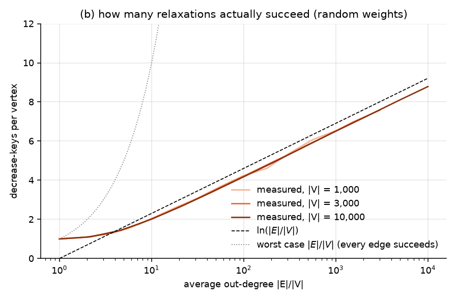

**Hardly any.** $D/\lvert V\rvert$, the number of times a vertex's distance is lowered, grows like
the **logarithm** of its in-degree, not linearly:

| average degree $k=\lvert E\rvert/\lvert V\rvert$ ($\lvert V\rvert=10^4$) | 1 | 10 | 100 | 1,000 | 9,999 |
|---|---:|---:|---:|---:|---:|
| decrease-keys per vertex, $D/\lvert V\rvert$ | 1.000 | 2.010 | 4.176 | 6.506 | 8.787 |
| $\ln k$ | 0 | 2.30 | 4.61 | 6.91 | 9.21 |
| fraction of relaxations that succeed, $D/\lvert E\rvert$ | 100 % | 20 % | 4.2 % | 0.65 % | **0.088 %** |

The three $\lvert V\rvert$ curves in fig 6 lie on top of each other, and for $k\ge10$ they track
$\ln k-0.4$ to within about 0.2. On a complete 10,000-vertex graph, only **one relaxation in 1,100**
lowers anything.

*Why logarithmic.* Vertex $v$ is offered a candidate distance $d[u]+w(u,v)$ by each in-neighbour $u$,
in the order those neighbours are extracted. A relaxation succeeds only if the candidate beats every
earlier one, i.e. it is a new running minimum. In a random sequence of $j$ values the expected
number of running minima is $H_j=1+\tfrac12+\dots+\tfrac1j\approx\ln j$. Later candidates also start
from larger $d[u]$ (vertices are extracted in increasing distance), which makes them even less
likely to win, so the measured count sits a little below $\ln k$. This matches a known result:
the expected number of decrease-keys is $O(\lvert V\rvert\log(1+\lvert E\rvert/\lvert V\rvert))$
for any graph structure, provided each vertex's incoming edge weights are drawn independently from
the same distribution (Goldberg & Tarjan, *Expected Performance of Dijkstra's Shortest Path
Algorithm*, Princeton University technical report, 1996). The generator here draws every weight
independently and uniformly, so the assumption holds.

**And each decrease-key is cheap.** Going from a tree to a complete graph at $\lvert V\rvert=10^4$
adds 77,872 decrease-keys and 142,944 heap comparisons: **1.84 comparisons each**, against a heap
height of $\log_2 10^4=13.3$. A vertex whose distance drops slightly usually only needs to pass its
parent, if anything. So on random weights the third term is about $2\lvert V\rvert\ln k$
comparisons, which is negligible, and the cost of (b) is effectively

$$T_b\approx c_1\lvert E\rvert+c_2\,\lvert V\rvert\log\lvert V\rvert\quad\text{(random weights).}$$

### Empirical: time vs $\lvert E\rvert$ at fixed $\lvert V\rvert$

**Fig 4.**

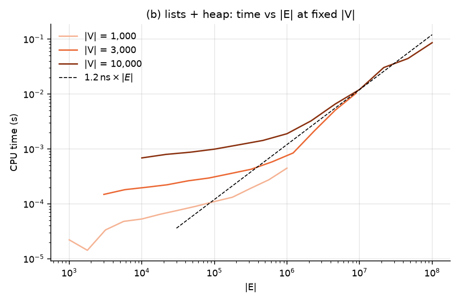

Each curve has the two regimes the formula above predicts. At low degree the
$\lvert V\rvert\log\lvert V\rvert$ extract-min work dominates and the curve is shallow. Once
$\lvert E\rvert\gg\lvert V\rvert\log\lvert V\rvert$ the curve joins the dashed **1.2 ns × $\lvert E\rvert$**
line. Time becomes **linear in $\lvert E\rvert$**, with no visible $\log\lvert V\rvert$ factor:

| $\lvert V\rvert=10^4$, $k=$ | 1 | 10 | 100 | 1,000 | 4,641 | 9,999 |
|---|---:|---:|---:|---:|---:|---:|
| time (ms) | 0.69 | 0.99 | 1.89 | 12.1 | 44.2 | 85.8 |
| time per edge (ns) | 68.5 | 9.9 | 1.89 | 1.21 | 0.95 | 0.86 |

Once the edges dominate, each one costs about **0.9–1.4 ns**: one comparison, plus, rarely, a
short sift.

### Empirical: time vs $\lvert V\rvert$ on large sparse graphs

`exp_sparse.csv`, $\lvert E\rvert=8\lvert V\rvert$, $\lvert V\rvert=2^{10}\ldots2^{22}$, **fig 5**.

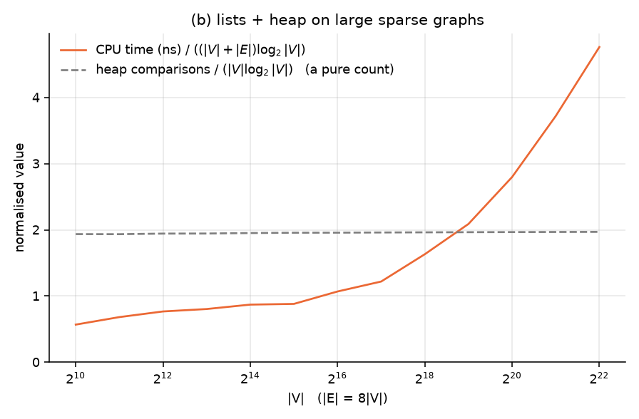

| $\lvert V\rvert$ | $2^{10}$ | $2^{14}$ | $2^{16}$ | $2^{18}$ | $2^{20}$ | $2^{22}$ |
|---|---:|---:|---:|---:|---:|---:|
| time | 0.052 ms | 1.80 ms | 10.1 ms | 69.3 ms | 528 ms | 3.95 s |
| heap comparisons ÷ $\lvert V\rvert\log_2\lvert V\rvert$ | 1.935 | 1.951 | 1.957 | 1.962 | 1.966 | 1.969 |
| time ÷ $(\lvert V\rvert+\lvert E\rvert)\log_2\lvert V\rvert$ (ns) | 0.57 | 0.87 | 1.07 | 1.63 | 2.80 | 4.76 |

Fig 5 shows two curves:

* **The operation count matches theory exactly.** Heap comparisons per $\lvert V\rvert\log_2\lvert V\rvert$
  stay at 1.94–1.97 across a 4,096-fold range of $\lvert V\rvert$. That is the "$\approx2\log_2 n$
  comparisons per sift-down" of a binary heap. Decrease-keys stay at 1.78–1.82 per vertex
  throughout, as fig 6 predicts for $k=8$.
* **The time per operation does not stay constant.** It rises gently until $\lvert V\rvert\approx2^{17}$,
  then climbs steeply. The working set is ~89 bytes per vertex here, so the graph and its arrays
  outgrow the 30 MB L3 cache at $\lvert V\rvert\approx3.4\times10^5\approx2^{18.4}$, which is where
  the bend is. From there on, each heap step and each $d[v]$ lookup is a random access to DRAM.
  The algorithm still does $(\lvert V\rvert+\lvert E\rvert)\log\lvert V\rvert$ work; each unit of
  that work just costs more, about 4.5× more at $2^{22}$ than at $2^{16}$.

### The worst case is real: the adversarial graph

The random-weight results show that the $\lvert E\rvert\log\lvert V\rvert$ term is usually dormant.
To check that the bound is nonetheless tight, `gen_adv` builds the input that wakes it up. On
vertices $0\ldots\lvert V\rvert-1$ with an edge $i\to j$ for every $i<j$:

* $w(i,i+1)=1$, so $\text{dist}(i)=i$, and vertices are extracted in order $0,1,2,\dots$;
* for $j>i+1$, $w(i,j)=A(\lvert V\rvert-i)+(\lvert V\rvert-j)-i$ with $A=2\lvert V\rvert$. Relaxing
  from $i$ then offers $j$ the key $A(\lvert V\rvert-i)+\lvert V\rvert-j$. The $A$ term falls by
  $A>\lvert V\rvert$ with each extraction, so this key is **always lower than $j$'s previous key**:
  every edge is a successful relaxation.
* Within $i$'s list (scanned in increasing $j$) the offered keys *decrease*. Each new key is
  therefore smaller than everything already in the heap, so **every decrease-key sifts its vertex
  all the way up**.

The verify suite checks that every one of the $\lvert E\rvert$ relaxations succeeds, and the
experiment confirms it at every size. `updates` = $\lvert E\rvert$ exactly (31,996,000 at
$\lvert V\rvert=8000$), and each decrease-key costs **11.3 comparisons**, against a heap height of
$\log_2 8000=13.0$. That is a full-height sift: the heap shrinks as vertices leave, so its average
height is about $\log_2\lvert V\rvert-1.4$. Heap comparisons total $0.87\,\lvert E\rvert\log_2\lvert V\rvert$:
the $O(\lvert E\rvert\log\lvert V\rvert)$ bound is attained, with constant 0.87. The same edge set
with random weights makes only 52,168 successful relaxations (0.16 %) and
$0.001\,\lvert E\rvert\log_2\lvert V\rvert$ comparisons. Fig 9 in §(c) shows what this does to the
running time.

### Verdict on (b)

$O((\lvert V\rvert+\lvert E\rvert)\log\lvert V\rvert)$ worst case, attained by the adversarial graph.
On random weights only $\approx\lvert V\rvert\ln(\lvert E\rvert/\lvert V\rvert)$ relaxations succeed,
so the measured behaviour is $\approx c_1\lvert E\rvert+c_2\lvert V\rvert\log\lvert V\rvert$: linear
in $\lvert E\rvert$ at about 0.9–1.4 ns per edge, plus a $\lvert V\rvert\log\lvert V\rvert$ floor
that dominates on sparse graphs. Every operation count tracks theory exactly. Per-operation cost
grows several-fold once the graph no longer fits in cache.

---

## (c) Comparing the two

### What the theory predicts

| | (a) matrix + array | (b) lists + heap |
|---|---|---|
| time | $\Theta(\lvert V\rvert^2)$ | $O((\lvert V\rvert+\lvert E\rvert)\log\lvert V\rvert)$ |
| sparse, $\lvert E\rvert=O(\lvert V\rvert)$ | $\Theta(\lvert V\rvert^2)$ | $O(\lvert V\rvert\log\lvert V\rvert)$ — **(b) wins asymptotically** |
| dense, $\lvert E\rvert=\Theta(\lvert V\rvert^2)$ | $\Theta(\lvert V\rvert^2)$ | $O(\lvert V\rvert^2\log\lvert V\rvert)$ — **(a) wins asymptotically** |
| memory | $\Theta(\lvert V\rvert^2)$ | $\Theta(\lvert V\rvert+\lvert E\rvert)$ |

Setting the two bounds equal gives a break-even at
$\lvert E\rvert\approx\lvert V\rvert^2/\log_2\lvert V\rvert$, i.e. a density of about
$1/\log_2\lvert V\rvert$: **7.5 %** at $\lvert V\rvert=10^4$. Below that (b) should win; above it, (a).

The measurements show that this crossover is the right answer only for adversarial input.

### Operation counts — independent of hardware

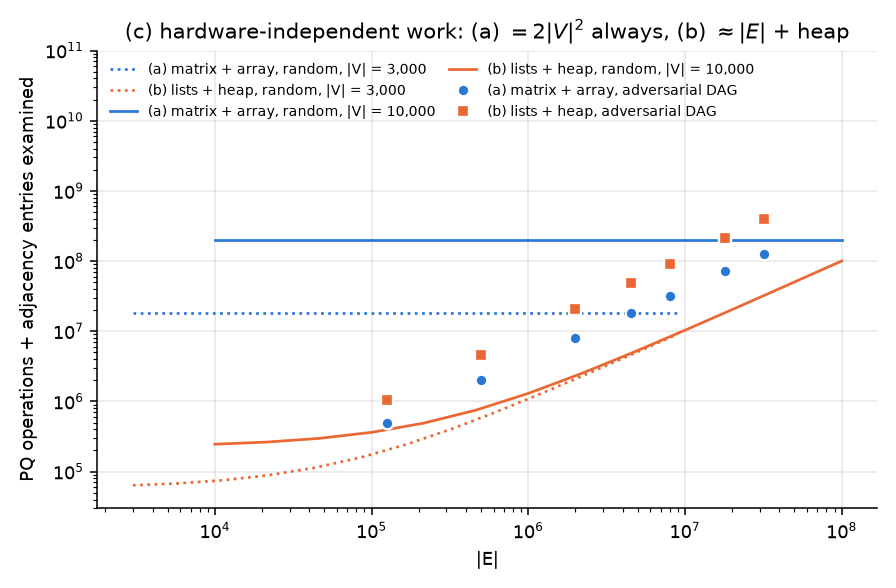

**Fig 11** plots total work (priority-queue operations + adjacency entries examined) for both
implementations. (a) is the flat line $2\lvert V\rvert^2$ whatever the graph. On random graphs (b)
does $\lvert E\rvert$ edge checks plus a small heap term, and stays **below** (a) at every density.
Even on the complete graph it does $1.004\times10^8$ operations against (a)'s $2\times10^8$, because
(b) touches each edge once while (a) touches each cell twice (once in the extract-min scan, once in
the row scan). Only on the adversarial graph (squares) does (b)'s work exceed (a)'s, by about
**3×**: $3.9\times10^8$ vs $1.28\times10^8$ at $\lvert V\rvert=8000$.

### Measured: time across the whole density range

`exp_vsE.csv`, **fig 7** (absolute times) and **fig 8** (ratio; above 1 means (b) is faster).

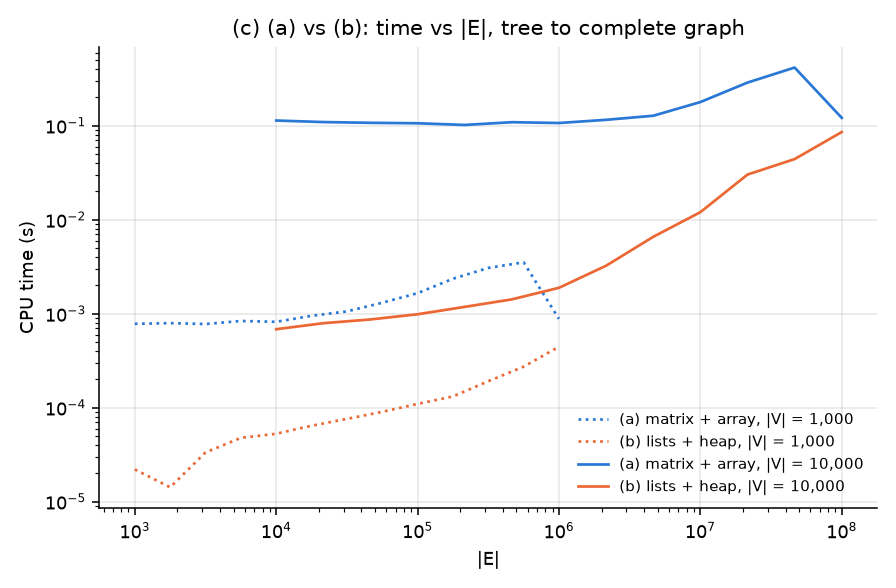

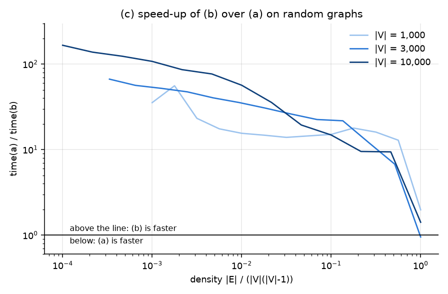

| density ($\lvert V\rvert=10^4$) | 0.01 % (tree) | 0.1 % | 1 % | 10 % | 46 % | 100 % |
|---|---:|---:|---:|---:|---:|---:|
| time (a) ÷ time (b) | **166×** | 108× | 57× | 14.8× | 9.4× | 1.42× |

* **Sparse graphs: (b) wins by orders of magnitude, and the margin grows with $\lvert V\rvert$.** At
  the sparsest point it is 35× at $\lvert V\rvert=10^3$, 67× at $3\times10^3$ and 166× at $10^4$.
* **The theoretical crossover (7.5 %) is not where the curves cross.** At 10 % density (b) is still
  15–22× faster, and at ~50 % density 7–13× faster.
* **On random graphs (b) never loses by more than 5 %.** On complete graphs it is 1.03–2.3×
  faster, with one exception: the complete 3,000-vertex graph in `exp_vsE.csv`, where (a) is 5 %
  faster.

The theory's crossover is in the wrong place because it assumes (b)'s worst case, where every
edge is a $\log\lvert V\rvert$ decrease-key. On random weights the operation counts (fig 11) show
(b) doing fewer operations than (a) at every density, half as many even on the complete graph.
(b)'s operations are somewhat more expensive: each reads an 8-byte (target, weight) pair and then
looks up $d[\text{target}]$, while (a) sweeps contiguous arrays. On the complete
$\lvert V\rvert=10^4$ graph that is ~0.86 ns per operation for (b) against ~0.61 ns for (a). That
1.4× is not enough to overturn a 2× difference in operation count. Near 50 % density (a) also pays
its misprediction hump from §(a). So the crossover moves out to the complete graph, where the two
come closest without (a) overtaking. (**Extra information E2** shows how far the dense end shifts
once that hump is removed. **E3** shows why (b)'s advantage on sparse graphs is so large.)

### Sparse graphs at scale — and memory

`exp_sparse.csv`, **fig 10**. (a) stops at $\lvert V\rvert=2^{14}$, where its matrix reaches 1 GiB.

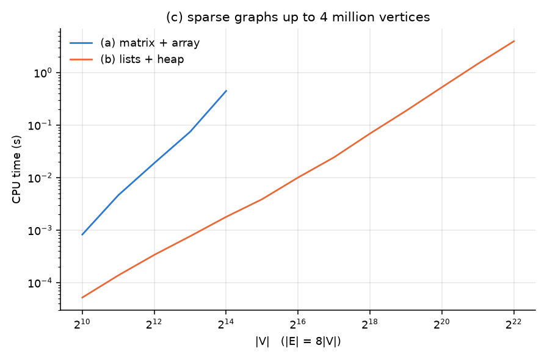

| $\lvert V\rvert$ ($\lvert E\rvert=8\lvert V\rvert$) | $2^{10}$ | $2^{11}$ | $2^{12}$ | $2^{13}$ | $2^{14}$ |
|---|---:|---:|---:|---:|---:|
| time (a) ÷ time (b) | 15.8× | 33.6× | 55.8× | 97.5× | **249.6×** |

The two curves have visibly different slopes on the log–log plot: about 2.2 for (a) (2, plus a
little extra once the matrix outgrows cache) and about 1.3 for (b).
The gap grows without bound. **Memory rules (a) out first, before time does:**

| $\lvert V\rvert$ | $\lvert E\rvert$ | (a): matrix, $4\lvert V\rvert^2$ bytes | (b): lists, $8(\lvert V\rvert+1)+8\lvert E\rvert$ bytes |
|---:|---:|---:|---:|
| 10,000 | 80,000 | 400 MB | 0.72 MB |
| 16,384 | 131,072 | 1.07 GB | 1.18 MB |
| 100,000 | 800,000 | 40 GB — exceeds this machine | 7.2 MB |
| 4,194,304 | 33,554,432 | 70 TB | 302 MB |

Real road networks or social graphs have millions of vertices and single-digit average degree.
For those, (a) cannot even be stored.

### Adversarial input: where (a) wins

`exp_adv.csv`, **fig 9**.

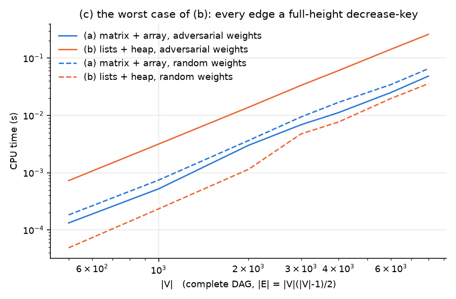

| $\lvert V\rvert$ (complete DAG) | 500 | 1,000 | 2,000 | 4,000 | 8,000 |
|---|---:|---:|---:|---:|---:|
| (a), adversarial weights (ms) | 0.13 | 0.52 | 3.01 | 11.2 | 48.6 |
| (b), adversarial weights (ms) | 0.73 | 3.16 | 13.9 | 60.7 | 260.5 |
| **time (b) ÷ time (a)** | **5.5×** | **6.1×** | **4.6×** | **5.4×** | **5.4×** |
| time (b) ÷ time (a), *random* weights on the same edges | 0.27× | 0.31× | 0.31× | 0.45× | 0.55× |

On the same edge set, changing only the weights turns (b) from **1.8–3.7× faster** than (a) into
**5.4× slower**. (a)'s time barely moves between the two weightings, because its work is
$2\lvert V\rvert^2$ regardless. (b)'s cost depends on the *weights*, not only on $\lvert V\rvert$ and
$\lvert E\rvert$; (a)'s does not. That predictability is (a)'s real advantage: it is the only one of
the two whose running time can be known from the graph's size alone.

### Which implementation is better, and when

| Situation | Better choice | Measured margin |
|---|---|---|
| Sparse graph ($\lvert E\rvert$ a small multiple of $\lvert V\rvert$) | **(b)** | 16× at 1k vertices → 250× at 16k, growing; (a) cannot even be stored beyond ~$10^5$ vertices |
| Moderately to very dense, typical (random) weights | **(b)** | 15–22× at 10 % density, 7–13× at ~50 %, well past the theoretical 7.5 % crossover |
| Complete graph, typical weights | **(b)**, or a near-tie | 1.03–2.3× on all but one complete graph; (a) 5 % faster on the complete 3,000-vertex graph |
| Dense graph, weights that make many relaxations succeed | **(a)** | (b) is 4.6–6.1× slower on the adversarial graph |
| Running time must be guaranteed from $\lvert V\rvert$ alone | **(a)** | exactly $2\lvert V\rvert^2$ operations on every input |
| Graph too large for $\lvert V\rvert^2$ memory | **(b)** — the only option | |

---

## Conclusions

1. **(a) is $\Theta(\lvert V\rvert^2)$ and does not depend on $\lvert E\rvert$ at all.** It performs
   exactly $2\lvert V\rvert^2$ array/matrix inspections on every graph (verified on all 82
   measurements), and the measured growth exponent is 2.05–2.12. At fixed $\lvert V\rvert$ its time
   still varies up to 4.5× with density, at an identical operation count. That variation comes
   from the CPU, not the algorithm (E1).

2. **(b) is $O((\lvert V\rvert+\lvert E\rvert)\log\lvert V\rvert)$ in the worst case, and the worst
   case is real.** The adversarial graph makes every edge a full-height decrease-key: 11.3
   comparisons each at $\lvert V\rvert=8000$, totalling $0.87\,\lvert E\rvert\log_2\lvert V\rvert$.

3. **On random weights that worst case almost never happens.** Only
   $\approx\lvert V\rvert\ln(\lvert E\rvert/\lvert V\rvert)$ relaxations succeed (0.088 % of edges on
   a complete 10,000-vertex graph), and each costs ~2 comparisons. (b)'s cost becomes
   $\approx c_1\lvert E\rvert+c_2\lvert V\rvert\log\lvert V\rvert$: linear in $\lvert E\rvert$ at
   ~0.9–1.4 ns per edge. Its heap-comparison count stays constant at
   $1.94\text{–}1.97\,\lvert V\rvert\log_2\lvert V\rvert$ across a 4,096-fold range of
   $\lvert V\rvert$. Its time per operation grows several-fold once the graph outgrows the L3
   cache.

4. **(b) is the better general-purpose implementation.** On random graphs it is faster than (a) at
   every density, with a single 5 % loss on one complete graph. It is 166× faster on the sparsest
   graph at $\lvert V\rvert=10^4$, 15–22× faster at 10 % density, and still 1.4× faster on the
   complete 10,000-vertex graph. Its advantage on sparse graphs grows with $\lvert V\rvert$, and it
   is the only one of the two that fits in memory beyond ~$10^5$ vertices.

5. **(a) wins when many relaxations succeed, and when a guaranteed running time matters.** It is
   5.4× faster on the adversarial graph at $\lvert V\rvert=8000$, and it is the only one of the two
   whose cost is fixed by $\lvert V\rvert$ alone.

6. **The theoretical break-even density is misleading.** $1/\log_2\lvert V\rvert\approx7.5\%$ comes
   from (b)'s worst case. On random weights, (b) does fewer operations than (a) at every density
   (fig 11), so no real crossover occurs on random graphs: the two come closest only at the
   complete graph.

---

## Limitations and threats to validity

* **Random weights are a modelling choice.** The central result, that (b) is far better than its
  worst case, depends on uniformly random weights making few relaxations succeed. Real graphs
  (road networks, for example) have structured weights. Their success rate will differ, and could
  be anywhere between the random case and the adversarial one shown here.
* **One graph per data point.** Operation counts on graphs this large vary very little between
  seeds (the three $\lvert V\rvert$ curves in fig 6 coincide), but the timings are from a single
  graph instance each.
* **Micro-architectural effects are machine-specific.** The density hump in (a), the zero-page
  slowdown, the cache bend in fig 5, and the per-operation costs that decide the complete-graph
  result are all real measurements on this CPU and kernel. Their sizes would shift on other
  hardware. The operation counts would not.
* **Timer resolution at the small end.** Runs under ~50 µs (the smallest sparse graphs with (b))
  are repeated many times per measurement, but still show a few microseconds of noise. No
  conclusion rests on those points.
* **One source vertex per run.** Each timed run computes shortest paths from vertex 0 only.
  *Input graphs* shows that other sources give the same results on these graphs. All-pairs
  workloads (running from every vertex) would multiply both implementations' costs by
  $\lvert V\rvert$ without changing their ratio.

---

## Extra information

Everything above uses only (a) and (b). This section answers three questions those two cannot
answer alone, using three variants outside the brief. Each variant was timed on the **identical
graphs** (same seeds) as the formal runs; the data is in `extra_*.csv`.

| Variant (`dijkstra.c` name) | What it changes relative to (a) or (b) | Used in |
|---|---|---|
| branch-free (a) (`mat_arr_bf`) | (a) with the "is there an edge?" test done by a conditional move instead of a branch. Same array, same counts | E1, E2 |
| lists + array (`list_arr`) | (a) with the matrix replaced by adjacency lists; same array priority queue | E3 |
| matrix + heap (`mat_heap`) | (b) with the lists replaced by the matrix; same heap | E3 |

### E1. Why (a)'s time depends on density — fills the gap in §(a)

§(a) found that (a)'s time at fixed $\lvert V\rvert$ varies up to 4.5× with density, even though it
always does exactly $2\lvert V\rvert^2$ operations.

**The cause is branch prediction.** The relaxation loop asks `if (M[u][v] != 0 && …)` for every
cell. Modern CPUs guess the outcome of each `if` before evaluating it, and pay ~15–20 cycles when
the guess is wrong.

* On a sparse graph almost every cell is 0, so the answer is almost always "no". The guess is
  almost always right.
* On a complete graph almost every cell is non-zero, so the answer is almost always "yes". Again
  easy to guess.
* Near 50 % density the answer is a coin flip for every cell, and roughly half the guesses are
  wrong.

That is exactly the shape of the hump in fig 3: flat at the sparse end, peak near 50 %, back down
at the complete graph.

**The test.** `mat_arr_bf` is (a) with one change. A missing edge is turned into an infinite
candidate distance with a conditional move, `candidate = (w != 0) ? d[u] + w : ∞`, instead of being
skipped by a branch. The only branch left, "is the candidate shorter than $d[v]$?", is almost never
true, so it is easy to predict at every density. Its operation counts are identical to (a)'s on
every graph.

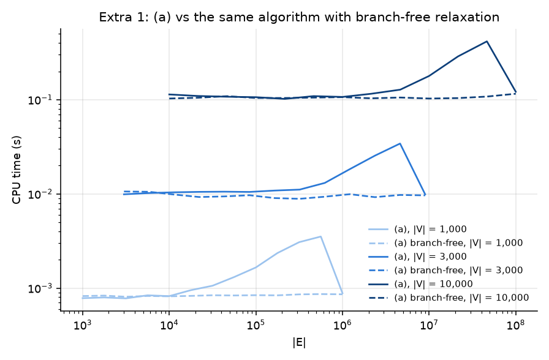

| $\lvert V\rvert$ | (a): min → max over all densities | branch-free (a): min → max |
|---:|---:|---:|
| 1,000 | 0.78 → 3.53 ms (**4.5×**) | 0.81 → 0.86 ms (**1.07×**) |
| 3,000 | 9.9 → 34.3 ms (**3.5×**) | 8.9 → 10.6 ms (**1.20×**) |
| 10,000 | 102 → 416 ms (**4.1×**) | 103 → 116 ms (**1.12×**) |

The hump disappears. The branch-free curves are flat to within 7–20 % from a tree to a complete
graph, which is the "$\Theta(\lvert V\rvert^2)$, independent of $\lvert E\rvert$" result measured
directly. Across $\lvert V\rvert$ (`extra_vsV.csv`) the branch-free version costs **0.8–1.1 ns
per $\lvert V\rvert^2$ at every density**. The 3.3–4.6× gap between the half-full curve and the
others in fig 1 is therefore misprediction. At the two ends, where the branchy test is already
well predicted, the two versions take about the same time.

### E2. Where the break-even lands against a faster (a) — supplements §(c)

§(c) found that on random graphs (b) never loses to (a) by more than 5 %. Part of (a)'s deficit
at intermediate densities is the misprediction hump from E1, which is a property of how the loop
executes, not of the algorithm. Comparing (b) against the branch-free (a) shows how much of that
result survives once the hump is removed.

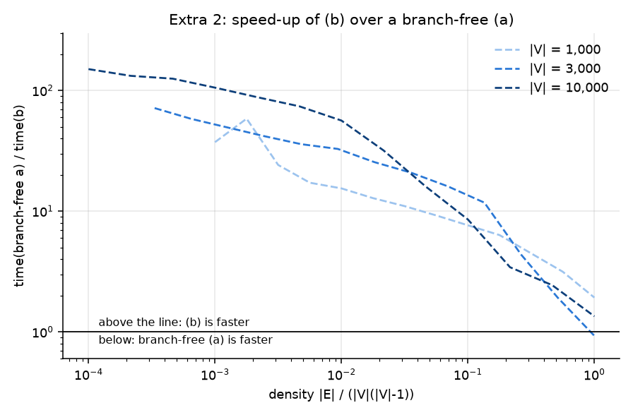

| density ($\lvert V\rvert=10^4$) | 0.01 % | 0.1 % | 1 % | 10 % | 46 % | 100 % |
|---|---:|---:|---:|---:|---:|---:|
| time (branch-free a) ÷ time (b) | 150× | 106× | 56× | 8.5× | **2.4×** | **1.35×** |

The sparse end is essentially unchanged. At high density the gap narrows a lot: at ~50 % density
(b) is now 1.8–3.7× faster (across `extra_vsV.csv`) instead of 7–13×. On complete graphs with
$\lvert V\rvert\ge2000$ the two come close: the ratio is 0.93–1.35, usually with (b) slightly
ahead. At $\lvert V\rvert\le1000$, (b) is still 1.8–2.2× faster. The per-operation costs predict where the
crossover should fall: (b) is cheaper while
$1.2\,\text{ns}\times\lvert E\rvert<0.58\,\text{ns}\times2\lvert V\rvert^2$, i.e. up to roughly the
complete graph itself. That matches the measured near-tie there.

So the formal conclusion holds even against a branch-free (a): there is no real crossover on
random graphs, only a tie at the complete-graph end. The theory's 7.5 % crossover is still far
too low.

### E3. Why (b)'s advantage on sparse graphs is so large — supplements §(c)

§(c) found (b) up to 250× faster on sparse graphs. (a) actually has **two** separate
$\lvert V\rvert^2$ terms: the extract-min scan over the array, and the scan of each matrix row. (b)
replaces both ingredients at once. Changing them one at a time shows how much each contributes.

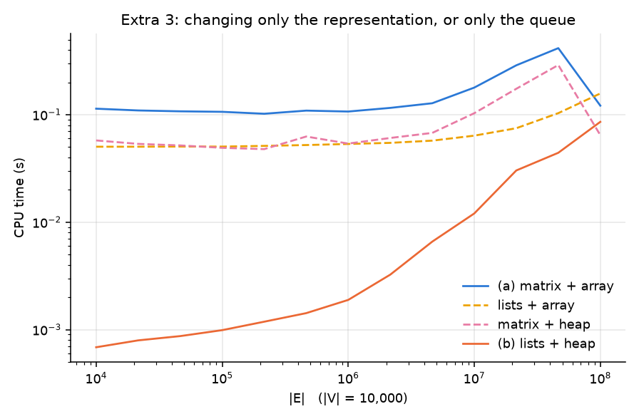

| $\lvert V\rvert=10^4$ (ms) | tree | 1 % | 46 % | complete |
|---|---:|---:|---:|---:|
| (a) matrix + array | 113.8 | 107.1 | 416.5 | 121.5 |
| lists + array (representation changed only) | 50.4 | 53.4 | 103.4 | 157.7 |
| matrix + heap (queue changed only) | 57.6 | 53.9 | 290.0 | **64.6** |
| (b) lists + heap | **0.69** | **1.89** | 44.2 | 85.8 |

* **Changing either one alone removes only one of the two $\lvert V\rvert^2$ terms.** On sparse
  graphs each single change roughly halves (a)'s time, but both stay $\Theta(\lvert V\rvert^2)$.
  On the tree they remain ~75–85× slower than (b). In the sparse sweep (`extra_sparse.csv`),
  lists + array is 415× slower than (b) at $\lvert V\rvert=2^{15}$, and matrix + heap 88× slower
  at $2^{14}$.
* **Only changing both removes every $\lvert V\rvert^2$ term**, which is why (b) drops from
  ~110 ms to 0.7 ms on the tree. Neither the lists nor the heap is "the" improvement. Each one pays
  off only together with the other.
* **At the complete-graph end, matrix + heap is faster than both (a) and (b).** When every cell is
  an edge, a matrix row is simply a denser adjacency list: 4 bytes per entry instead of 8, read in
  order, with no index lookup. Meanwhile the heap's extract-min is still far cheaper than an array
  scan. Across `extra_vsV.csv` it beats (b) on every complete graph, by 1.1–2.1×, and it beats
  (a) by 1.9× at $\lvert V\rvert=10^4$. For complete graphs with typical weights, a hybrid of the
  two implementations is better than either.
